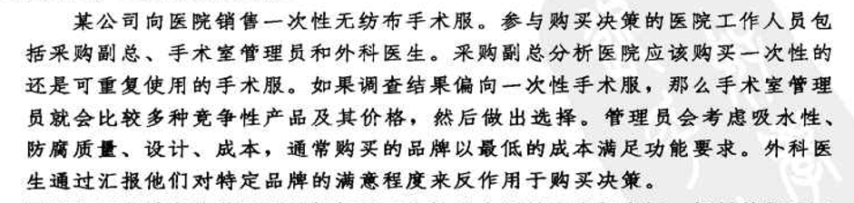
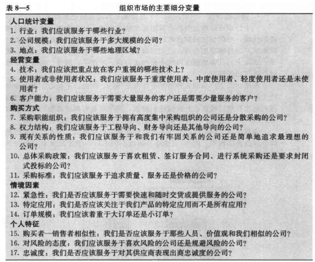

# 营销管理第三篇

## 第七章　分析组织市场
1. 什么是组织购买
2. 组织购买过程中的参与者
3. 采购流程
4. 组织购买过程的阶段
5. 管理组织间客户的关系
6. 机构与政府市场

##  第八章  识别细分市场和目标
1. 细分消费者市场的基础
2. 细分组织市场的基础
3. 目标市场选择

# 第七章 分析组织市场

## 什么是组织购买

企业组织并不只是销售，还有购买。销售者要了解这些组织的需求、资源、政策和购买程序。

* ***组织市场*** ---->包括所有购买产品和服务用以生产、出售、出租或提供给其他组织为目的的产品和服务的组织。

组织市场的销售行为笔消费者市场涉及更多的项目和资金

组织市场拥有消费者市场相同的挑战。一项对B2B公司的调查显示，他们面临着如下挑战

1. 以新的方式深刻理解消费者的需求
2. 识别组织发展的新机遇
3. 改善价值管理技术和工具
4. 更好地衡量营销成果和责任指标
5. 在全球市场中竞争和发展，特别是在中国市场
6. 通过更快地将创新产品投入市场，并转向更有竞争力的商业模式来对抗产品和服务商品化的威胁
7. 说服高级决策人员接受营销理念并支持强健的营销项目

*　采购类型
1. 直接重购： 采购部门根据管理重构产品。通过提供新产品或者争取到小额订单逐渐扩大采购份额

2. 调整性重购： 购买者希望修改产品的规格、价格、交货要求或其他条件。采购名单里的供应商会感到不安，
名单外的供应商很难过会看到商机

3. 新采购任务： 采购者首次购买某一服务或产品。成本或风险越大，决策参与者就越多，信息收集也越多

## 组织购买过程中的参与者

### 采购中心
1. 发起者： 请求购买物品的人，包括使用者和其他人
2. 使用者： 使用产品和服务的人。通常，使用者首先提出购买建议，并协助确定对产品的要求
3. 影响着： 影响购买决策的人，技术人员、其他评价者
4. 决定者： 决定产品要求和供应商的人
5. 批准者： 批准行动方案的人
6. 购买者： 实施采购行为的人
7. 守门人： 有权力阻止销售人员或信息接近采购中心成员的人。

### 企业定位与采购中心

* 企业定位 组织营销者有多种方法对市场，从而确定他们开展销售的公司类型
一旦确定营销活动关注的企业类型，公司必须决定如何能以最好的方式向销售产品或服务。

尽管组织营销者能获取到任何关于个性和人际因素都有用，但是而他们不可能确切知道那种群体动力在购买过程中发挥了作用。
小型销售更关注核心的购买印象概念股者，较大规模的销售商则深入地、多层次地接触尽可能多的参与者。
组织营销者必须定期检查有关采购中心参与者的假想

## 采购流程

阻止购买者会寻求市场产品成本有关的最高受益方案。阻止购买者的购买动机成为抑制成本和一直收益差异间差异的一个函数。
营销者的任务就是推出一个可盈利的产品，并向目标卖家提供卓越的客户价值。

# 组织购买过程的阶段
我们将描述阻止购买决策过程的各个阶段，帕特克里·J·罗宾森及其同事在购买放歌框架中指出的，组织购买要经过八个购买阶段

1. 问题识别：
采购开始：内部刺激--公司需要通过某一产品或服务得到满足，外部刺激引起的

2. 总需求说明和产品规格的确定
确定总体特征和需要的数量。标准物品，涉及范围小；复杂物品，涉及范围大。
采购者与其他人员（工程师、用户等）共同决定所需特征--可靠性、耐用性、价格等。组织营销者可以通过说明其产品如何能满足
甚至是禅悦这些需求来协助购买者
3. 寻找供应商
*　目录网站：电子目录，电子采购软件---顾安捷公司的Grainger
*　垂直市场：专门的电子商务中心
*　纯拍卖网站：利氏兄弟拍卖行
*  专用交换: 专用交换市场，与特别邀请的供应商和合作伙伴紧密连接
*  易贸市场：
*  团购
3. 供应商的选择
在选择供应商之前，购买中心将规定所希望的供应商的品质，并对他们进行排名，下面是一个通用的供应商评估模型

4. 绩效评估
购买者通常通过三种方法定期审核选定的供应商绩效
* 接触最终用户并请求他们做出评价；
* 采用加权打分的方法用几个标准对供应商进行评分；
*　或者对绩效差的供应商成品进行汇总，得出经过调整的包括价格在内的采购成本
绩效评估可以引导购买者继续、调整或终止与供应商的关系

## 管理组织间客户的关系

许多因素会对组织间关系的发展造成影响。四个相关因素是：替代品的有效性、供给的重要性、供给的复杂性和供应市场的活力。
在此基础上，我们可以将‘购买者--供应商’关系分为八种类型

1. 基本买卖型： 简单、例行的交换--属于中等水平的合作和信息交流
2. 梗概型：这类交易需要买家进行更多的调整--合作和信息交流较少
3. 合约交易型：有合约规范，信任、合作和互动的水平低
4. 客户关系型： 竞争大于合作
5. 合作体系型： 伙伴在业务上紧密合作，但是双方都不通过法律手段或自我调整来表明结构性承诺
6. 协作型: 在协作交流中，更多的信任和承诺能产生真正的伙伴关系
7. 相互适应型：双方都作出很多明确的关系调整，但不是一定能达成强烈的信任或合作
8. 顾客至上型： 这种密切的协作关系，忙方为了满足客户需求进行调整，但并不期待交流方式发生调整或改变

这些关系角色会在不同情况被激活。当需求可以有基本的供应商满足，买家不希望也不需要和供应商建立密切的关系，同时，
供应商可能发现投资发展潜力有限的消费者是不值得的
* 一项研究表明：当供给对客户非常重要髌骨存在采购障碍时，客户与供应商之间的关系最为密切
* 另一项研究表明： 只有存在环境的高度不确定性，并且有适度的专用投资时，双方通过信息交流和规划建立的垂直协调才具有必要性

## 机构和政府市场
1. 组织机构市场：学校、医院、疗养院、监狱以及其他想自己关注的人提供货物和服务的单位组成。购买的目的不是为了盈利，
如果医院采购的食品引起病人的抱怨，会影响医院名誉，就会寻找组织机构的食品供应商，质量超过最低质量标准。
许多食品销售者成立专门的部门相应机构购买者的特殊需求
2. 政府机构的购买不仅数额巨大，次数也大。但是需要接受公开审核，会要求供应商提供大量的文件。供应商常常对官僚作风、
法规、决策延迟以及采购的人事变动产生抱怨

#  第八章  识别细分市场和目标

公司不可能在大型、广泛或多样的市场中于所有顾客建立联系。
- 他们可以将这样的市场划分为具有不同需要和需求的消费者群体或细分市场。
- 确定哪些细分市场是它可以有效服务的

为了了解每一个细分市场与众不同，要正确识别和满足细分市场是营销成功的关键

## 细分消费者市场的基础

市场细分将一个市场划分为界限清楚的几部分，一个细分市场由一组具有相似需要和需求的消费者组成。
营销者的任务在于识别细分市场的适当数量和性质，并决定以哪一个市场为目标

用两组变量细分消费者市场

-- 一些人通过地理、人口统计特征和心理统计特征来确定细分市场，然后检验消费者细分市场是否呈现出不同的需要或产品反馈

-- 一些人尝试通过行为因素来确定细分市场

无论哪一种关键在于使营销计划能根据识别的消费者差异进行调整

* 地理细分

将市场划分为地理单元，公司在不同的区域经营，但是必须关注局部的差异，公司可以使其营销计划更接近个体消费者并与之建立私人联系
	Curves ,一个针对中年妇女的连锁运动中心，将它的纸袋放在冰淇淋店，披萨店等可以使消费者产生内疚的本地商业场所

* 人口统计细分

- 年龄和生命周期 ： 佳洁士和高露洁 针对儿童、成年和老人三个产品线
- 生活阶段： 结婚、离婚、赡养老人、同居、购房等阶段性需求
- 性别： 男女对消费有着不同的态度和行为
- 收入： 汽车、服装、化妆品、金融产品和旅游这些行业长期进行收入细分

* 心理统计细分
VALS(价值观与生活方式模型)，
1. 四种拥有较高资源水平的群体是：
- 创新者：拥有高自尊、成功、富有经验、积极、具有领导才能的人。所购物品通常反映出对较高级、有利于导向的产品和服务的偏好

- 思考着：受思想驱动、成熟、满足、深思熟虑的人，重视秩序、知识和责任。他们寻求产品的持久性。功能性和价值

- 成就者： 关注事业和家庭、成功且有目标的人。他们喜欢能向同龄人展现成功的顶级产品

- 体验者：追求多变和刺激、年轻、热情、有冲动的人。他们花费在时尚、娱乐和社交商
2. 四种较低资源水平的群体
- 有信仰者：有具体的信念、保守传统。对已有品牌忠诚（果粉，米粉）
- 奋斗着： 资源有限、追求时髦、喜爱娱乐。喜欢时髦的产品，可以模仿拥有更多物质财富的人的消费
- 生产者：喜欢用自己的双手工作、实际、脚踏实地、自给自足的人。使用目的和功能目的为主
- 幸存者： 担心变化的年长人。对品牌忠诚

营销者根据他们对VALS模型的理解运用到营销计划中

* 行为细分
- 需要和利益
行为细分中，营销者根据消费者对产品的了解、态度、使用或反馈来将其划分成不同群体
	狂热者、形象追求者、精明购物者、传统主义者、满意的尝试者、被征服者

## 细分组织市场的基础
根据一些消费者市场中的变量来细分组织市场，下表展示了一些比较重要的变量。

## 目标市场选择
***罗杰·贝斯特(Roger Best)***建议的细分市场七步骤

* 有效的市场细分标准

并不是所有的市场细分方案都是有效的，我们可以将买盐的顾客分为金发和棕发的，但是头发颜色与买盐无关。想要有效，
市场细分要做好五个关键指标

***可测量*** 细分市场的规模、购买力和特征可以测量

***足够大*** 细分市场的规模和利润大到值得为之服务。汽车制造商不会为身高为4英尺的人群设计并制造车辆

***可进入*** 细分市场可以被有效地触及和服务

***可区分*** 细分市场在概念上时刻区别的，已婚和未婚女性对香水的反映是类似的

***可操作*** 能明确制定有效的方案以吸引和服务细分市场

* 评估和选择细分市场
在评估不同细分市场时，公司必须考虑两方面因素：细分市场的总体吸引力；公司的目标和资源
营销者有一系列或李娜徐行的可能细分层次，可以知道他们的目标市场决策

大众化市场----->定制化市场

- 覆盖整个市场 : 大型公司才可以使用覆盖整个市场战略
- 多元细分市场： 依照选择性专业化，公司会挑选有可能细分市场的一个子集。
保洁推出佳洁士美白贴片,目标市场包括刚订婚的女性，即将成为新娘的女性和男同性恋者，飘柔去屑，海飞丝柔顺等

- 单一细分市场： 保时捷集中于跑车（成功），大众的辉腾（失败），公司可以通过生产，分销和推广的专业化来获取利益
- 个体细分市场： 细分到极致 ，私人定制，不是用每一个公司，汽车就很难实现
