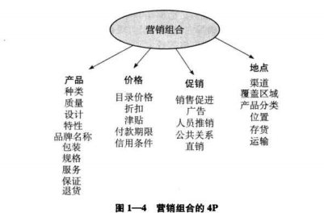
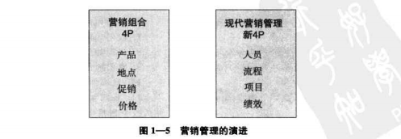

# 营销管理
## 学习材料：《营销管理：第14版：全球版（美华管理人才学校 图书馆）》
## 章节及主讲人：
* 第一篇：理解营销管理

  第二篇：获取营销洞察

  范顺凯
* 第三篇  了解认识顾客

  第四篇  培育强大品牌

  赵谦
* 第三篇  开发市场供应物

  第四篇  交付价值

  张亮
* 第七篇  传播价值

  第八篇  实现成功的长期成长

  霍春刚

## 为什么学习本书
1. 本书有什么内容

	现在的产品销售者正在实施全方位营销，通常包括以下四种营销活动

	* **内部营销** ->确保组织中所有成员都遵循相应的营销原则，特别是公司的高层管理人员

    假设框架 ：满意的员工产生满意的客户，要想赢得客户满意，首先要让员工满意；只有满意的员工才可能以更高的效率和效益为外部客户提供更加优质的服务，并最终使外部客户感到满意
	* **整合营销**->确保公司运用各种手段或方式来创造、交付和传播价值，并且是以最佳的方式组合起来加以运用的
	* **关系营销**->与顾客、渠道成员和其他营销伙伴建立恰当的多重关系
	* **绩效营销**->测量并管理营销活动和营销项目的投资回报率，并综合考虑其影响，特别是法律、伦理、社会和环境影响

	本书贯穿以上四种营销活动

2. 本书有什么优点
	* 管理导向 ->本书重点强调营销管理人员和高层管理人员在围绕市场需求和机会时努力协调组织目标、能力和市场资源面临的主要诀策
	* 分析方法 ->提供分析常规问题的概念工具和框架，并通过案例阐述重要的营销原理、营销战略和营销实践
	* 多科学视角->整合了不同领域的研究成果--经济学、行为科学、管理理论和数学，其中的概念和工具可以直接运用到市场营销实践中去
	* 普遍适用性->运用战略思维，有形产品，无形服务等营销对象进行了详细阐述，涵盖了各种组织--盈利、非盈利、国内外大小公司等
	* 综合性和全面性->本书涵盖了富有经验的营销管理人员在实施战略营销、策略营销和营销管理中需要了解的所有主题

# 第一篇 理解营销管理
## 一、21世纪的市场营销
1. 营销的重要性
	* 营销无处不在
2. 市场营销的范畴
	* **市场营销** ->识别并满足人类和社会的需要，简洁说：“满足别人并获得利润”
	* **营销管理**->艺术和科学的结合，通过创造、交付和传播优质的顾客价值来获得、挽留和提升顾客的科学和艺术（推销管理的艺术）
	* 营销对象->产品、人物、事件、体验、服务、场所、产权、组织、信息、想法
	* **营销者** ->从**潜在客户**中寻求响应的人，要刺激消费者对产品的需求
	* 潜在需求类型->对产品需求可能是下面八种之一
		1. 负需求
		2. 无需求
		3. 潜在需求
		4. 下降需求
		5. 不规则需求
		6. 充分需求
		7. 过度需求
		8. 不健康需求

	营销者必须确定没中潜在需求的基本原因，然后制定促使改种需求类型向自己所洗完的需求类型类型发生转变的行动方案
	* 市场 ->
		* 传统概念--买卖双方在一起交易的场所
		* 经济学概念--对某一特定产品和某一类产品买与卖双方的集合（房产市场和粮食市场）

		**市场流程结构图**

    	

    	**简单的营销系统**

    	

3. 营销的核心概念
	* 需要、欲望和需求
		***需要*** 是人类最基本的要求，如：空气、水、衣服和场所。人类同样有创新、接受教育和娱乐的需要；当存在具体商品满足需要时，需要就变成了***欲望***。欲望往往受社会所制约；
		***需求***是有支付能力购买具体的商品来满足的欲望，很多人想买保时捷，只有部分人买得起，保时捷公司就要测算有多少人能买得起

		营销者不创造需要，需要先于营销者存在，营销者却对人的额需要和欲望产生影响，下面提供五种模型分析消费者的需要和欲望
		1. 明确表述的需要（顾客想要一辆不是很贵的车）
		1. 真正需要（顾客想要成本很低，不只是价格低）
		1. 未明确表述的需要（从销售者哪里购买到更优质的服务）
		1. 令人愉悦的需要（获赠导航系统）
		1. 秘密需要（顾客希望朋友把自己当内行）
	* 目标市场、市场定位和市场细分

		 沃尔沃->顾客所购买的最安全的汽车
	* 供应物和品牌
		品牌是具有明确来源的供应物的一种标志

	* 价值与满意
		* 价值 = 价格  ->满意
		* 价值 > 价格  ->高兴
		* 价值 < 价格  ->不满意
	* 营销渠道
		* 传播渠道
		* 分销渠道
		* 服务渠道
	* 供应链 -> 原材料到顾客的渠道链
	* 竞争
	* 市场营销环境
1. 新的营销现实
	* 主要的社会因素：新的社会因素使市场也有了翻天覆地的变化，具体来说主要包括12个因素
		1. 网络信息技术
		* 全球化
		* 放松管制
		* 私有化
		* 激烈的竞争
		* 产业交融
		* 零售转型
		* 脱媒 ->美国在线，亚马逊，雅虎等网络公司改变传统的分销渠道中货物的流动，尝试直接交付产品和服务并获得了惊人的成功
		* 消费者的购买力
		* 消费者信息
		* 消费者参与
		* 消费者抵制->品牌忠诚度降低，对营销方式和价格价值更加关心，特别是营销方式的抵制达到前所未有的高度
	* 企业新能力
		1. 营销者可以把互联网做为扩大其势力范围的信息渠道和销售渠道
		2. 营销者可以收集到有关市场、消费者、潜在顾客和竞争者的更全面更丰富的信息
		3. 营销者通过社交媒体发布和推广某品牌信息
		4. 企业内沟通，培训招聘，调研，提高效率

1. 全方位营销观念

	**全方位营销**观念是以开发	、设计和实施营销计划、过程及活动的相互依赖性，每个细节都重要，下面是全方位营销的简图和4个主题

	

	**营销谬误和戒律**

	

1. 对4P进行更新
	* 麦卡锡把不同的营销活动概括成四大营销组合工具，即营销4P：产品（product）、价格(price)、地点(place)和促销(promotion)，如图所示

    

	* 根据现代营销的广度、复杂性和丰富性，上述4P无法准确反映营销活动，还需要下面一组反映现代营销现实并具有代表性的营销概念：人员(people)、流程(process)、项目(project)、绩效(performance)，如图所示

		

3. 营销管理的任务
	* 制定营销战略和计划
	* 获取营销洞察
	* 与顾客建立联系
	* 塑造强势品牌
	* 设计市场供应物
	* 交付价值
	* 传播价值

## 二、制定营销战略和营销计划
	营销管理过程中，关键因素就是能够指导营销活动的、具有远见卓识的、富有创造性的营销战略和营销计划

	一方面企业要坚持一种有效的战略，另一方面企业也要不断用新方法改进自己战略
	营销战略也越来越依赖于“为企业的一系列产品和服务制定相应的战略”

### 公司和部门的战略计划
	所有公司为每个业务单位制定目标，并参与制定具体的业务单位战略

1. 确立公司使命
	参照**彼得·德鲁克**的经典问题：我们的企业是干什么的？顾客是谁？我们对顾客的价值是什么？我们的业务将是什么？听起来简单，却是最大难题。

	亚马逊从全球最大的网上书店调整为网上商店，成功的调整自己的使命

	当公司的使命能够反映公司愿景--一个几乎不可能实现的梦想（一个10~20年公司发展方向）时，就达到了使命的最高境界

		eg：索尼公司前总裁盛田昭夫希望每个人都可以携带供个人可使用的可移动音响，结果他的公司就发明了随身听和cd随身听

	好的使命陈述往往有以下五个特点

	

2. 建立战略业务单位
	* 公司根据业务领域的界定建立战略业务单位，从三个方面界定一个业务领域：
		顾客群、顾客需要和技术

			eg：一家专门为电视摄影棚设计白炽照明系统的小微型企业，顾客群是摄影棚，顾客需要就是照明，技术就是白炽照明
	大公司有往往同时经营不同的业务，战略业务单位有以下特点：
		* 独立的业务或相关业务集合体，能和公司其他业务分離開单独编制
		* 有自己的竞争对手
		* 有专门的经理人员负责战略计划、企业利润
	确定公司的战略业务单位的目的，就是要制定独立的战略，并配置适当的资源。公司既有”“昨日的辉煌”也有'明日之星'，做好资源配置是很必要的
3. 给每个战略业务单位配置资源
4. 评估成长机会
	* 密集型成长机会->公司现有业务领域寻找未来的发展机会
	* 一体化成长机会->建立或收购与目前业务相当的业务
	* 多样化成长机会->增加公司目前业务无关，富有吸引力的业务

### 业务部门的战略计划

机会矩阵

# 第二篇 获取营销洞察
## 一、收集信息和预测需求
1. 现代营销信息系统的构成

    每个企业都应当构建连续的信息流 ，并将信息分发给营销经理。**营销信息系统**由收集、分类、分析、评估和向决策者分发及时精确所需信息的人员、设备和程序构成。
    系统由企业**内部报告**、**营销情报**活动和营销调研来运行

2. 内部报告

    营销经理通过有关订单、销售、价格、成本、库存水平、应收账款、应付账款等内部报告来获取信息，发现重要的市场机会，识别潜在的管理问题

    订单收款系统、销售信息系统、数据库、数据仓库和数据挖掘

3. 营销情报
    营销情报系统：训练鼓励销售人员，激励分销商、零售商 ，雇佣外部专家，网络，顾问小组的形式获取营销情报

4. 分析宏观环境
    * 认识到需要和趋势：区别时尚、趋势、大趋势

    时尚：不可预测，短期，没有社会经济政治意义的

    趋势：比时尚更有预见性，更持久，具有势头和持久性。比如三鹿奶粉的倒下

    大趋势：社会、政治、经济和技术的大变化，其形成很慢 ，一旦形成将影响7~10年甚至更长事件

5. 预测和需求测量
    * 市场需求的预测

    公司可以根据6种产品层次，5种不同空间层次和3个不同时间层次来实行90种不同类型的需求估算
    几种不同方法将根据市场区分不同类型

    **潜在市场**->对商品有某种程度兴趣的。要求有足够的收入并能接近这类产品

    **有效市场**->有兴趣，有足够收入，能接触的人群

    **目标市场**->有效市场中，公司决定经营的市场

    **渗透市场**->购买公司产品的消费者群体

    

>   微软

## 二、营销调研和需求测量
1. 营销调研系统
    通过营销调研，营销经理才能深入理解顾客态度和购买行为。**营销洞察**能够针对为什么要评价和如何评价市场中的营销效果，所观察的结果对于营销者有何种意义等提供诊断信息

    * 专门的营销调研部门，
    * 雇佣专门的营销调研公司实施营销调研
    * 其他方式
        * 委托学生或者教授进行设计和实施。通用电气和希尔顿酒店等一些公司都热衷于众传播进行调研。如：对一主题举行创新大赛或者活动请学生参加，并向参与者提供赞助
        * 利用互联网。浏览竞争对手的网站监测社交群的聊天信息等获取有用情报
        * 观察竞争对手。小公司，如饭店、旅馆可以直接观察定期访问等方式了解对手的经营情况
        * 专业合作伙伴。合作伙伴间共享相关市场知识
2. 营销调研的程序

    有效的营销调研应当包括六个步骤

    

    eg

    

    营销问题的界定不能空泛，‘如找出头等舱乘客的所有需要’，调研人员就会无所适从，
    如果说'次航班中是否有足够的乘客愿意支付25美金使用网络服务，这个收费标准能否使公司提前一年达到收支平衡？'，这样又过于具体

    调研内容：
    1. 哪一类型的头等舱乘客可能使用飞机上网络服务
    2. 每一档价格分别有多少乘客愿意用
    3. 有多少人因为这样服务选择本航空公司
    4. 为企业形象带来多久的长期声誉
    5. 相对于其他项目（增加插头、其它娱乐设施）对乘客的重要性更大
    调研计划：
    观察法、焦点小组访谈法、调查法、行为资料分析法和实验法
3. 测定营销的生产率
    营销投入可能是短期的，产出的品牌知名度、品牌形象和品牌忠诚度和潜在客户的提升却要几个月时间才能体现，很难分离出某次营销活动的成效
    * **营销绩效指标** ->是一组能帮助营销人员将企业的营销绩效进行量化、比较和解释的一组测量指标
        营销绩效的评价分两部分：短期效果和品牌资产变化

    **营销指标举例**

    

    * 营销组合建模
        营销人员根据销售数据使用多变量分析，回归分析去整理每一项营销因素如何影响营销结果

        能分解营销结果，不能评价营销元素在组合模型中的作用，沃顿商学院的***大卫.雷博斯坦提出三个缺点
        1. 只关注增长却不关注基础销售和长期效果
        2. 将顾客满意、顾客认识和品牌资产融入有局限性
        3. 很难与竞争对手的指标相统一
    * 营销监视板
        1. 顾客绩效积分卡

        

        2. 利益相关绩效积分卡
        员工、供应商、银行、分销商、零售商和股东满意度。根据这指标相对调整营销方案

        营销咨询专家**帕特.拉普安特**认为营销监视板能够提供企业运营所需要的所有最新最及时的必要信息,他认为当今营销者主要使用四条测定‘路径’

        

·
·
··
·
·

·
·

·

·
·

·
·

·
·
·

·
·
·

·
·
·

·

# 本次分享结束，谢谢大家！
·
·

·
·

·
·

·
·

·
·

·
·

·
·

·
